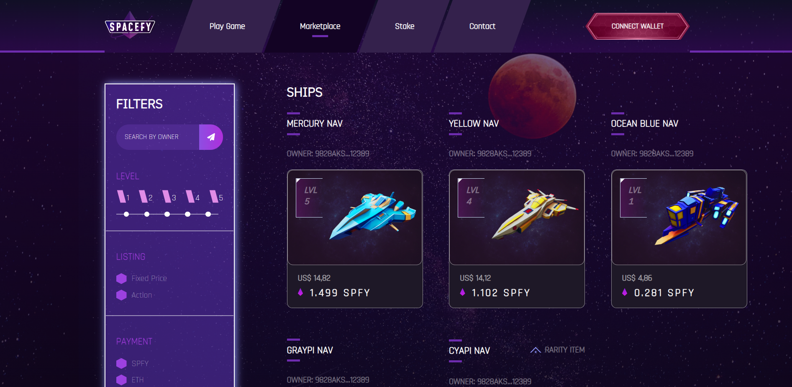

# Spacefy

## About
Simple page built IN VueJS for a technical test, simulating a marketplace of spaceship NFT's. 
<br/>

<div style="display: inline_block"><br>
    
</div>
<br/>

## Project status
<h4> 
	🚧 Finished 🚧
</h4>
<br/>

## The project
<b>
 
<br/>

## Project setup
```
npm install
```

### Compiles and hot-reloads for development
```
npm run serve
```

### Compiles and minifies for production
```
npm run build
```

<br/>
Install <a href="https://git-scm.com/">GIT</a> and <a href="https://nodejs.org/en/">NodeJS</a> on your computer.
<br/><br/>
<b>Author:</b> <a href="https://beacons.ai/danvinicius">Daniel Vinícius</a>
